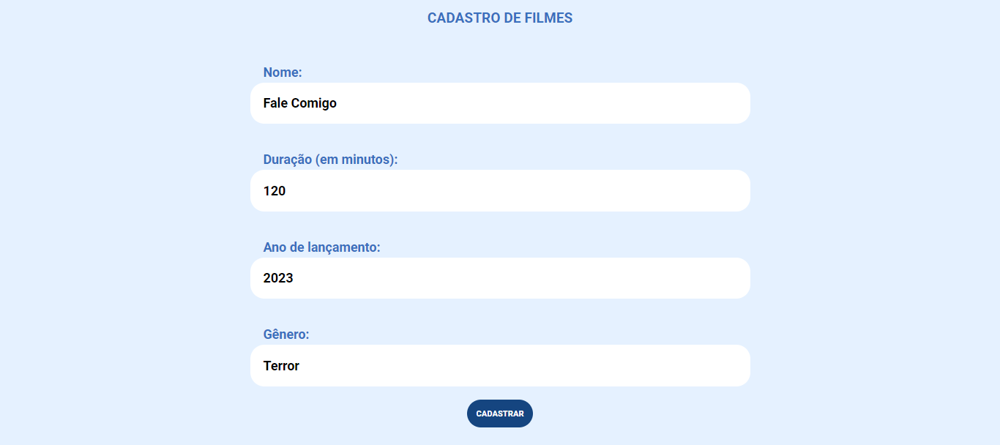
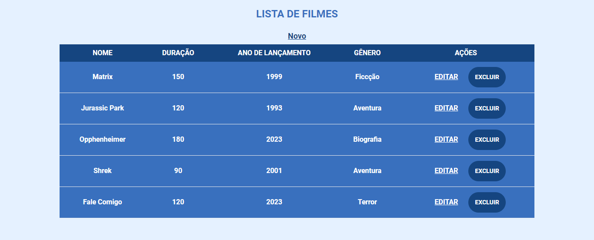

# ScreenMatch

Projeto Java Web de uma página para cadastro de filmes, utilizando métodos CRUD.

## Tópicos abordados durante esse projeto:
* Criação de uma aplicação Web com SpringWeb.
* Estrutura de projetos com Maven
* Criação dos métodos CRUD (criar, ler, atualizar e deletar).
* Conexão com banco de dados MySQL.

## Tecnologias utilizadas no projeto
* Java
* Spring Boot
* MySQL

<h3>Contribuindo</h3>

⭐️ Star o projeto

🐛 Encontrar e relatar issues
